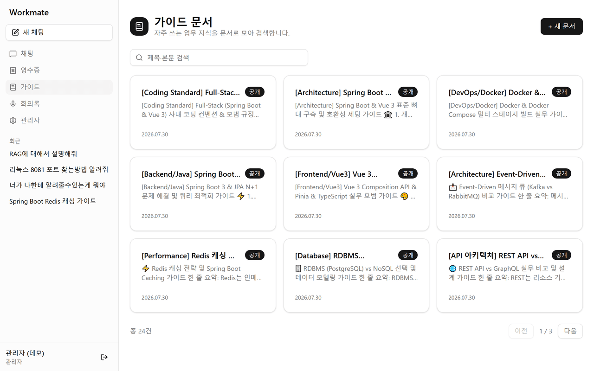
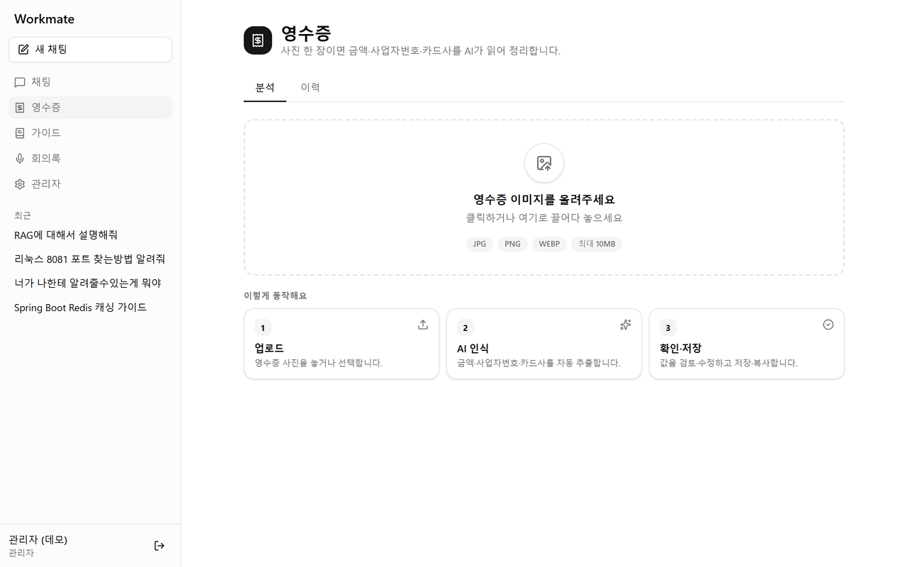
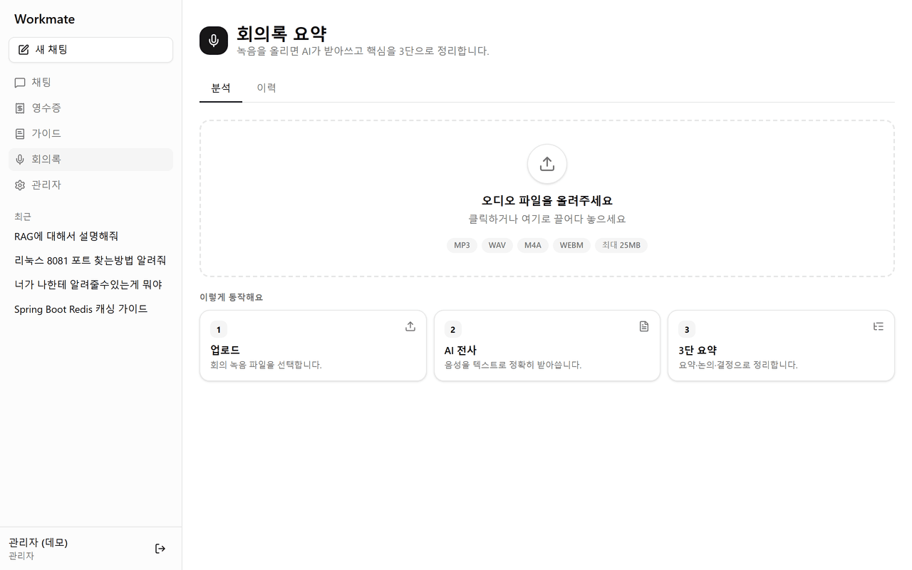
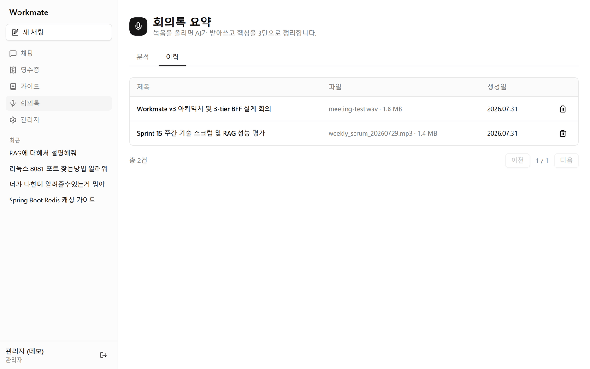

# Workmate

Spring AI로 만든 사내 업무 비서 웹앱이다. LLM 채팅을 중심으로 영수증 인식, 사내 가이드 검색(RAG), 회의록 요약 같은 업무 보조 기능을 한 화면에 모았다.

Vue3 단독 SPA(프론트) · 얇은 BFF(세션·프록시) · AI 비즈니스 서버(WAS)로 나눈 3-tier 구조이며, 브라우저는 BFF만 바라본다. 이렇게 나눈 배경과 트레이드오프는 [ADR](docs/project/adr/)에 정리해 뒀다.

개발 기간: 2026.07 ~ (1인 개발)

**스트리밍 채팅** — Spring AI(Gemini) 응답을 SSE로 토큰 단위 스트리밍하고, 사내 가이드를 먼저 검색(RAG)해 출처와 함께 답한다.


|                       로그인                        |                  사내 가이드 RAG                   |
| :---------------------------------------------------: | :--------------------------------------------------: |
|                  |                 |
|                     영수증 분석                     |                  영수증 인식 이력                  |
|  |  |
|                     회의록 요약                     |                  회의록 요약 이력                  |
|    |    |

## 주요 기능

- **스트리밍 채팅** — Spring AI(Gemini) 응답을 SSE로 토큰 단위 스트리밍한다. 기본적으로 사내 가이드를 먼저 검색(RAG)해 근거가 있으면 출처와 함께 답하고, 없으면 순수 AI 답변으로 자동 폴백한다.
- **영수증 자동 인식** — 이미지를 멀티모달로 분석해 금액·사업자번호·결제일을 뽑아낸다.
- **사내 가이드 RAG** — pgvector에 임베딩한 가이드 문서를 검색해 답변에 인용한다.
- **회의록 요약** — 회의 음성을 받아 STT + AI 요약으로 회의록을 만들고, 원본 오디오와 함께 이력으로 보관한다.
- **관리자** — 사용자 관리와 감사 로그.

인증은 JWT가 아니라 세션(Spring Security, httpOnly 쿠키, CSRF 적용)으로 처리한다. 이유는 [ADR-0001](docs/project/adr/0001-hybrid-ssr-to-vue3-spa.md)에 적어 뒀다.

## 구조

브라우저는 8080(WEB)만 바라본다. WEB은 DB에 직접 접근하지 않고 `/api` 프록시로만 WAS를 호출하는 얇은 BFF다.

```
브라우저 (Vue3 SPA)
   │  HTTP(세션) + SSE
workmate-web (:8080)   얇은 BFF — SPA 서빙 · 세션 인증 · /api 프록시 · SSE 중계
   │  (내부망)
workmate-was (:8081)   비즈니스 로직 · JPA/MyBatis · Spring AI
   │
PostgreSQL 17 + pgvector
```

- **workmate-vue** — Vue 3.5 · Vite 8 · TypeScript · Vue Router 5 · Pinia 3 · Tailwind v4 + shadcn-vue(Reka UI)
- **workmate-web** — Java 17 · Spring Boot 3.5 · Spring Security(세션) · SPA 서빙 + 프록시
- **workmate-was** — Java 17 · Spring Boot 3.5 · Spring AI 1.1(Google GenAI) · JPA + MyBatis · PostgreSQL 17 + pgvector
- **빌드** — Gradle 8.13 멀티 프로젝트 (WEB 빌드 시 Vue 산출물 자동 포함)

## 실행

DB → WAS → WEB 순으로 띄우고 브라우저로 8080에 접속하면 운영과 동일하게 확인할 수 있다.

```bash
docker compose up -d db                 # pgvector PostgreSQL 17
./gradlew :workmate-was:bootRun         # 8081, .env의 Gemini·AES 키 필요
./gradlew :workmate-web:bootRun         # 8080, Vue 빌드까지 자동
```

프론트만 따로 핫리로드로 개발할 때는 `cd workmate-vue && npm run dev` (5173, `/api`는 8080으로 프록시). DB 환경 구축은 [WSL2·Docker 셋업 가이드](docs/development/08_DOCKER_WSL2_SETUP_GUIDE.md) 참고.

DB를 처음 올리면 `db/init/`의 스키마와 데이터가 자동으로 들어간다. 가이드 문서 24건은 pgvector 임베딩까지 함께 시드되고, `demo.admin@example.com` / `Workmate!2026` 으로 로그인하면 위 스크린샷과 같은 화면을 그대로 볼 수 있다. 위 이미지는 목 데이터가 아니라 이 상태의 앱을 실제로 캡처한 것이다(`node scripts/capture-all-perfect.js`).

## 문서

- [docs/README.md](docs/README.md) — 전체 문서 색인 (여기서 시작)
- [프로젝트 종합 개요](docs/project/PROJECT_OVERVIEW.md) · [개발 진입점(HANDOVER)](docs/project/HANDOVER.md)
- [아키텍처](docs/development/01_ARCHITECTURE.md) · [프론트 구조](docs/development/02_FRONTEND_STRUCTURE_GUIDE.md) · [ADR](docs/project/adr/) · [로드맵](docs/project/ROADMAP.md)

## 라이선스

[MIT](LICENSE)

