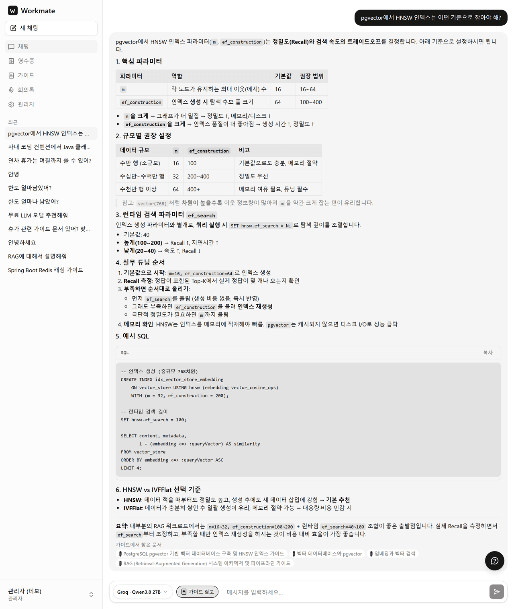
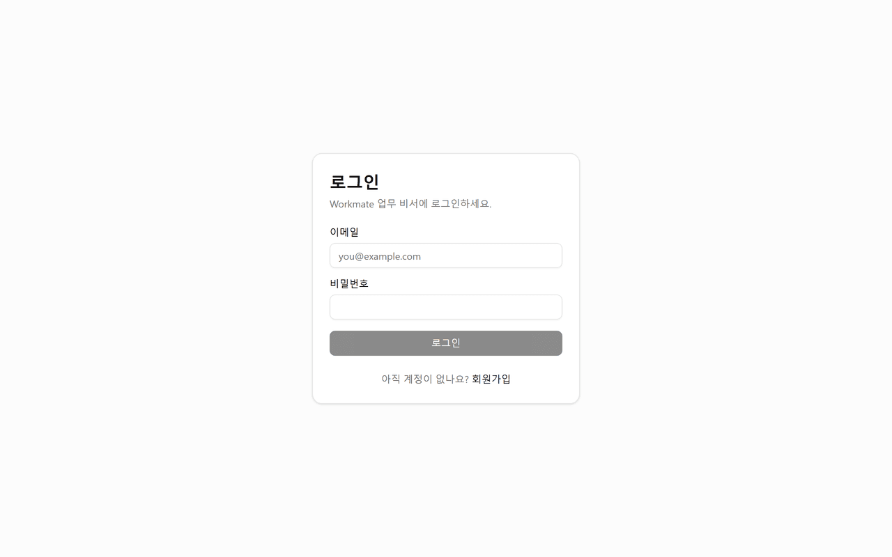
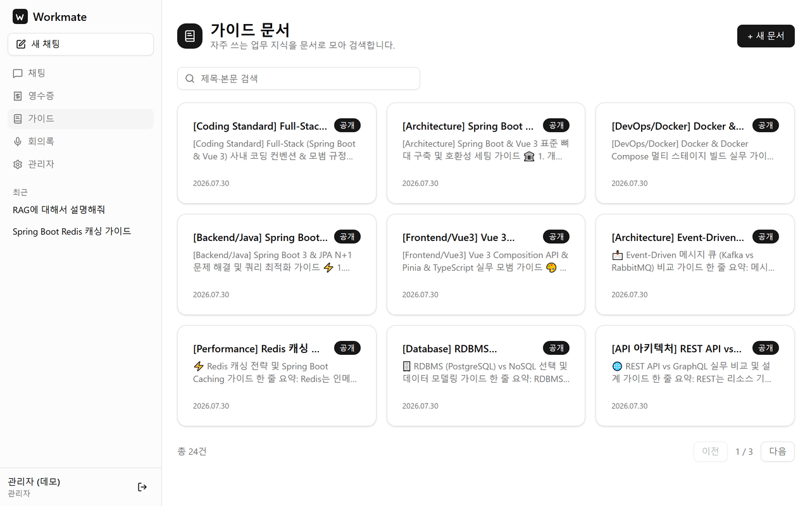
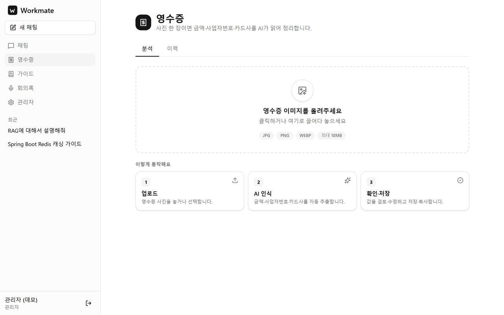
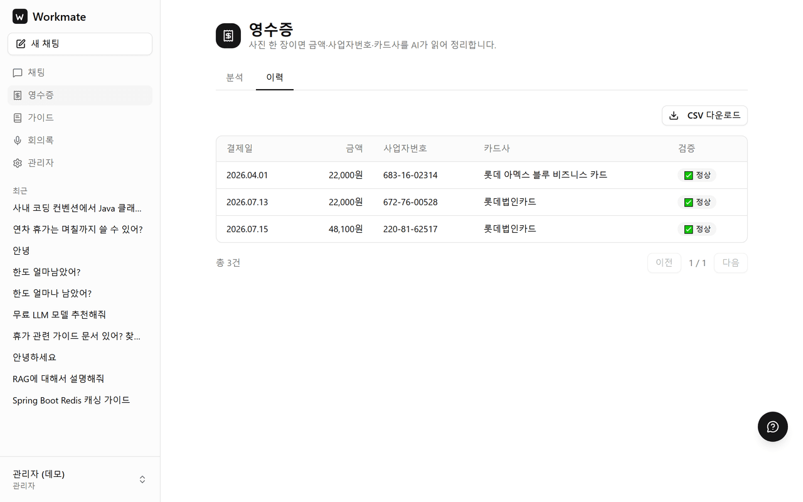
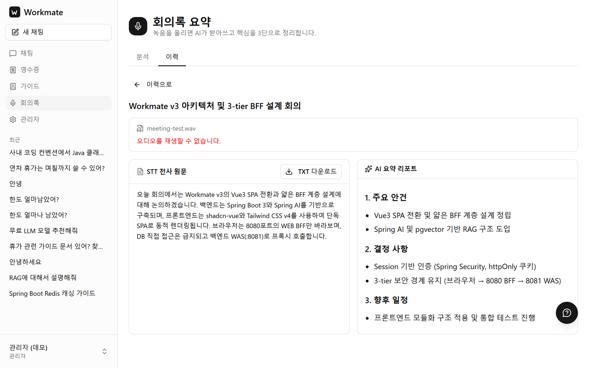
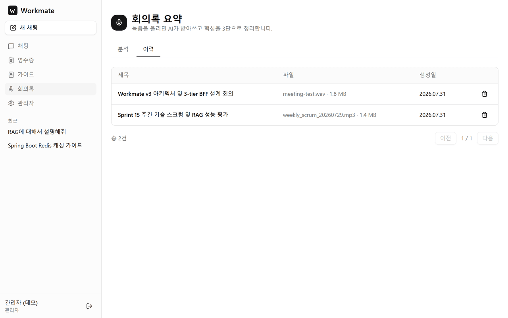
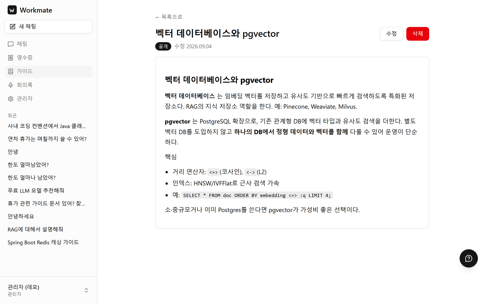
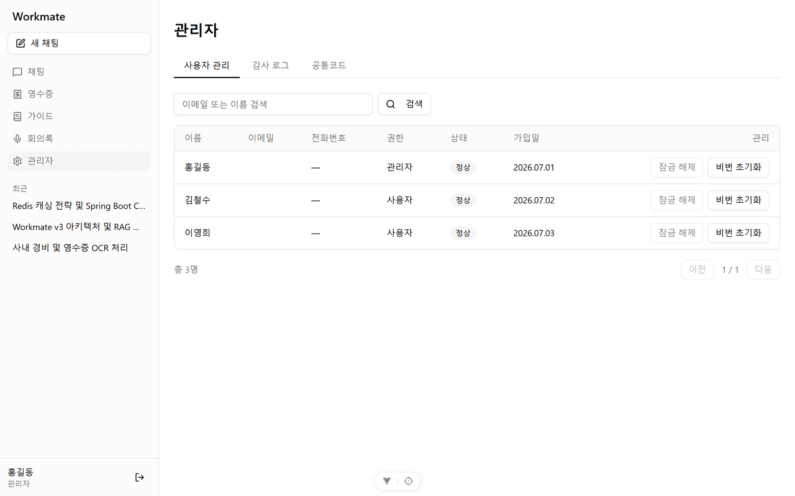

# Workmate

[](https://github.com/taekyung96/workmate-v3/actions/workflows/ci.yml)

Spring AI로 만든 사내 업무 비서 웹앱이다. LLM 채팅을 중심으로 영수증 인식, 사내 가이드 검색(RAG), 회의록 요약 같은 업무 보조 기능을 한 화면에 모았다.

Vue3 단독 SPA(프론트) · 얇은 BFF(세션·프록시) · AI 비즈니스 서버(WAS)로 나눈 3-tier 구조이며, 브라우저는 BFF만 바라본다. 이렇게 나눈 배경과 트레이드오프는 [ADR](docs/project/adr/)에 정리해 뒀다.

개발 기간: 2026.07 ~ (1인 개발)

**스트리밍 채팅** — Spring AI(Gemini) 응답을 SSE로 토큰 단위 스트리밍하고, 사내 가이드를 먼저 검색(RAG)해 출처와 함께 답한다.



|                       로그인                        |                  사내 가이드 RAG                   |
| :---------------------------------------------------: | :--------------------------------------------------: |
|                  |                 |
|                     영수증 분석                     |                  영수증 인식 이력                  |
|  |  |
|                   회의록 AI 요약                    |                    회의록 이력                     |
|      |    |
|                  사내 가이드 상세                   |                관리자 · 사용자 관리                |
|      |           |

## 주요 기능

- **스트리밍 채팅** — Spring AI(Gemini) 응답을 SSE로 토큰 단위 스트리밍한다. 기본적으로 사내 가이드를 먼저 검색(RAG)해 근거가 있으면 출처와 함께 답하고, 없으면 순수 AI 답변으로 자동 폴백한다.
- **영수증 자동 인식** — 이미지를 멀티모달로 분석해 금액·사업자번호·결제일을 뽑아낸다.
- **사내 가이드 RAG** — pgvector에 임베딩한 가이드 문서를 검색해 답변에 인용한다.
- **회의록 요약** — 회의 음성을 받아 STT + AI 요약으로 회의록을 만들고, 원본 오디오와 함께 이력으로 보관한다.
- **관리자** — 사용자 관리와 감사 로그.

인증은 JWT가 아니라 세션(Spring Security, httpOnly 쿠키, CSRF 적용)으로 처리한다. 이유는 [ADR-0001](docs/project/adr/0001-hybrid-ssr-to-vue3-spa.md)에 적어 뒀다.

## 구조

브라우저는 8080(WEB)만 바라본다. WEB은 DB에 직접 접근하지 않고 `/api` 프록시로만 WAS를 호출하는 얇은 BFF다.

```
브라우저 (Vue3 SPA)
   │  HTTP(세션) + SSE
workmate-web (:8080)   얇은 BFF — SPA 서빙 · 세션 인증 · /api 프록시 · SSE 중계
   │  (내부망)
workmate-was (:8081)   비즈니스 로직 · JPA/MyBatis · Spring AI
   │
PostgreSQL 17 + pgvector
```

- **workmate-vue** — Vue 3.5 · Vite 8 · TypeScript · Vue Router 5 · Pinia 3 · Tailwind v4 + shadcn-vue(Reka UI)
- **workmate-web** — Java 17 · Spring Boot 3.5 · Spring Security(세션) · SPA 서빙 + 프록시
- **workmate-was** — Java 17 · Spring Boot 3.5 · Spring AI 1.1(Google GenAI) · JPA + MyBatis · PostgreSQL 17 + pgvector
- **빌드** — Gradle 8.13 멀티 프로젝트 (WEB 빌드 시 Vue 산출물 자동 포함)

## 실행

DB → WAS → WEB 순으로 띄우고 브라우저로 8080에 접속하면 운영과 동일하게 확인할 수 있다.

```bash
docker compose up -d db                 # pgvector PostgreSQL 17
./gradlew :workmate-was:bootRun         # 8081, .env의 Gemini·AES 키 필요
./gradlew :workmate-web:bootRun         # 8080, Vue 빌드까지 자동
```

프론트만 따로 핫리로드로 개발할 때는 `cd workmate-vue && npm run dev` (5173, `/api`는 8080으로 프록시). DB 환경 구축은 [WSL2·Docker 셋업 가이드](docs/development/08_DOCKER_WSL2_SETUP_GUIDE.md) 참고.

DB를 처음 올리면 `db/init/`의 스키마와 데이터가 자동으로 들어간다. 가이드 문서 24건은 pgvector 임베딩까지 함께 시드되고, `demo.admin@example.com` / `Workmate!2026` 으로 로그인하면 위 화면들을 그대로 볼 수 있다. 위 이미지는 목 데이터가 아니라 이 상태의 앱을 찍은 것이다(`node scripts/capture-all-perfect.js`). 맨 위 채팅 화면만은 캡처할 때 실제로 질문을 던져 받은 답이라 실행할 때마다 내용이 달라진다.

> **기존 볼륨을 재사용할 때** — `db/init/*.sql` 은 볼륨을 처음 만들 때만 실행된다. 이미 만들어 둔 `workmate-db` 볼륨에는 이후 추가된 스크립트가 적용되지 않아 `ddl-auto: validate` 가 실패한다. 이때는 누락분만 수동 적용한다 — 각 스크립트 머리말에 적용 명령이 적혀 있다. 예: `docker exec -i workmate-db psql -U workmate -d workmate_db < db/init/15-chat-message-sources.sql`.

## 검증

기능이 "있다"가 아니라 "동작한다"를 남기기 위해, 자동화 테스트와 RAG 검색 품질 평가 하네스를 함께 둔다. 아래 수치는 모두 재현 명령과 측정 조건을 같이 적었다.

### 자동화 테스트

| 대상             | 테스트 |   결과 | 실행 명령                              |
| ---------------- | -----: | -----: | -------------------------------------- |
| **workmate-was** |    102 | 102 통과 | `./gradlew :workmate-was:test`         |
| **workmate-web** |      9 |  9 통과 | `./gradlew :workmate-web:test`         |
| **workmate-vue** |      3 |  3 통과 | `cd workmate-vue && npm run test:unit` |

WAS 테스트 일부는 실제 PostgreSQL 에 붙는 통합 테스트다. `docker compose up -d db` 로 DB 를 먼저 띄워야 하며, DB 없이 실행하면 스프링 컨텍스트 로딩 단계에서 실패한다. 위 결과는 `db/init/*.sql` 만으로 새로 만든 빈 DB 에 대해 측정했다 — 즉 저장소를 클론한 상태에서 그대로 재현된다.

**측정 조건** — 2026-08-28 · Windows 10 · Temurin JDK 17.0.19 · Gradle 8.13 · Vitest 4.1.10 · pgvector/pgvector:pg17 · `--rerun-tasks` 로 캐시 없이 1회 전체 실행.

같은 절차를 [GitHub Actions](.github/workflows/ci.yml)에서도 돌린다. push·PR 마다 PostgreSQL 컨테이너를 띄우고 `db/init/*.sql` 을 적용한 뒤 통합 테스트까지 실행하므로, 위 수치는 로컬 환경에만 의존하지 않는다.

### RAG 검색 품질 평가

검색이 "그럴듯해 보인다"에 그치지 않도록, 골든셋(질의–정답 문서 쌍) 33문항을 만들고 `topK`·`threshold` 를 격자로 훑어 **Hit@K·MRR·Miss rate** 를 재는 평가 하네스를 붙였다. 운영 기본값(`topK=4`·`threshold=0.4`)은 이 측정 결과를 근거로 정했다.

```bash
docker compose up -d db              # db/init 시드 → 가이드 24건
./gradlew :workmate-was:seedGuides   # 평가용 면접 가이드 보충(멱등) → 34건
./gradlew :workmate-was:ragEval      # 평가 실행 → docs/features/rag-eval/REPORT-<날짜>.md 생성
```

**측정 조건** — 2026-08-28 · 가이드 34건 · 골든셋 33문항 · dev DB(pgvector/pgvector:pg17) · 실제 Gemini 임베딩 · Temurin JDK 17.0.19 · 동일 조건 2회 실행에서 같은 값 재현.

| 골든셋 | 코퍼스 | MRR (th 0.3~0.5) | Hit@K (th 0.6) | threshold 간 편차 |
| --- | ---: | ---: | ---: | --- |
| 23문항 (2026-07-29) | 17건 | 1.000 | 100.0% | 없음 — **포화** |
| **33문항 (2026-08-28)** | **34건** | **0.970** | **97.0%** | **있음** |

첫 골든셋은 주제가 뚜렷이 갈려 전 구간 Hit@K 100% 로 **포화**됐다. `topK`·`threshold` 를 바꿔도 결과가 변하지 않아 튜닝 여지가 드러나지 않았고, 이는 하네스 결함이 아니라 질의가 쉽다는 신호로 읽었다. 주제가 겹치는 문서를 늘리고(17건 → 34건) 교차·모호 주제 10문항을 더하자 비로소 트레이드오프가 관찰된다 — threshold 를 0.6 까지 올리면 재현율이 깎이고(Hit@K 97.0%), `topK` 는 2~8 전 구간에서 결과가 같아 늘릴수록 프롬프트 토큰만 는다. **기본값 `topK=4`·`threshold=0.4` 는 양쪽 손해를 피하는 지점이다.**

재평가 첫 시도에서는 Hit@K 51.5% 가 나왔는데, `topK` 2·4·6·8 에서 값이 완전히 동일한 평탄한 형태였다. 검색 성능 저하라면 topK 에 따라 값이 움직여야 하므로 **정답 문서가 코퍼스에 없다**는 뜻으로 읽었고, 실제로 평가용 가이드 17건 중 7건만 DB 에 남아 있었다. 이 하네스는 검색 품질뿐 아니라 **코퍼스 무결성 회귀**도 잡는다. 전체 스윕표와 상세 해석은 [평가 리포트](docs/features/rag-eval/REPORT-2026-08-28.md) 참고.

### 개선 — 불필요한 재임베딩 제거 (429 쿼터 대응)

**문제** — 가이드 수정은 본문이 한 글자도 바뀌지 않아도 기존 임베딩을 전부 지우고 다시 만들었다(`updateGuide`: `deleteEmbeddings()` → `saveEmbeddings()`). 그런데 제목·공개여부는 청크 **메타데이터**일 뿐 임베딩 벡터에 반영되지 않는다. 즉 제목만 고치는 수정에서 임베딩 API 호출은 전부 낭비였다. 무료 티어는 분당 요청 한도가 낮아 이 낭비가 곧 **429 (Too Many Requests)** 로 이어졌다 — 원인 분석은 [쿼터 이슈 문서](docs/architecture/RAG_VECTORSTORE_EMBEDDING_QUOTA_GUIDE.md) 참고.

**조치** — 본문 변경 여부를 먼저 판별해, 본문이 그대로면 재임베딩 대신 `vector_store` 의 메타데이터만 jsonb 병합으로 갱신한다. 갱신 대상 청크가 0건이면(과거 적재 실패) 그때만 신규 적재로 폴백한다.

**결과** — 수정 1회당 임베딩 API 호출 수(청크 단위):

| 수정 유형 | 개선 전 | 개선 후 |
| --- | ---: | ---: |
| 제목만 변경 | 1.12회 | **0회** |
| 공개여부만 변경 | 1.12회 | **0회** |
| 본문 변경 | 1.12회 | 1.12회 (변화 없음) |

**측정 조건** — 2026-08-28 · 코퍼스 가이드 34건 / 청크 38개(문서당 평균 **1.12** 청크, 최대 2) · 호출 수는 `EmbeddingModel` 을 세는 스텁으로 계수 · 재현: `./gradlew :workmate-was:test --tests "*GuideUpdateEmbeddingCostTest"`.

개선 전 값은 "문서의 청크 수만큼 매번 호출"이므로 코퍼스 평균 청크 수(1.12)가 곧 평균 호출 수다. 문서가 길수록 절감폭도 그대로 커진다(현재 코퍼스 최대 2회 → 0회). 검색 품질에는 영향이 없다 — 본문이 그대로인 문서는 벡터를 손대지 않기 때문이며, 변경 후 재실행한 위 RAG 평가에서도 Hit@K·MRR 이 이전 실행과 동일했다.

### 기술 판단과 기각한 대안

선택만 적지 않고 **버린 선택지와 그 이유**를 남긴다. 전문은 [ADR](docs/project/adr/)에 있고, 핵심만 옮기면 다음과 같다.

| 결정 | 채택 | 기각한 대안 → 이유 |
| --- | --- | --- |
| 서버 구성 ([ADR-0001](docs/project/adr/0001-hybrid-ssr-to-vue3-spa.md)) | 얇은 WEB(BFF) + 내부망 WAS | **단일 Spring Boot 통합** → 주인공인 WAS 에 세션·SPA 서빙을 얹어야 함 · **SPA 가 WAS 직접 호출** → WAS 노출 + 인증 재설계 |
| 인증 ([ADR-0001](docs/project/adr/0001-hybrid-ssr-to-vue3-spa.md)) | 세션(httpOnly 쿠키) | **JWT** → stateless 라 계정잠금·중복로그인 차단에 필요한 **즉시 무효화**가 어려움. 대가로 CSRF 방어가 필요해져 Spring Security CSRF 활성화 |
| 프론트 구조 ([ADR-0002](docs/project/adr/0002-frontend-structure-and-ui.md)) | 기능별 모듈 | **타입별 구조** → 현 규모엔 무난하나 모듈 경계·콜로케이션 이점을 못 살림 |
| UI ([ADR-0002](docs/project/adr/0002-frontend-structure-and-ui.md)) | shadcn-vue + Tailwind v4 | **순수 CSS 유지** → 완성도 대비 시간 소모가 커 AI 작업 시간을 잠식 |
| 권한 ([ADR-0003](docs/project/adr/0003-was-modifiable-and-guide-admin-authz.md)) | WAS 에서 소유자+관리자 판정 | **프론트에서 버튼만 숨김** → 화면과 동작 불일치 · **WEB 에서 권한 판단** → 로직이 중계 계층으로 새어 3-tier 위반 |

## 문서

- [docs/README.md](docs/README.md) — 전체 문서 색인 (여기서 시작)
- [프로젝트 종합 개요](docs/project/PROJECT_OVERVIEW.md) · [개발 진입점(HANDOVER)](docs/project/HANDOVER.md)
- [아키텍처](docs/development/01_ARCHITECTURE.md) · [프론트 구조](docs/development/02_FRONTEND_STRUCTURE_GUIDE.md) · [ADR](docs/project/adr/) · [로드맵](docs/project/ROADMAP.md)

## 라이선스

[MIT](LICENSE)

