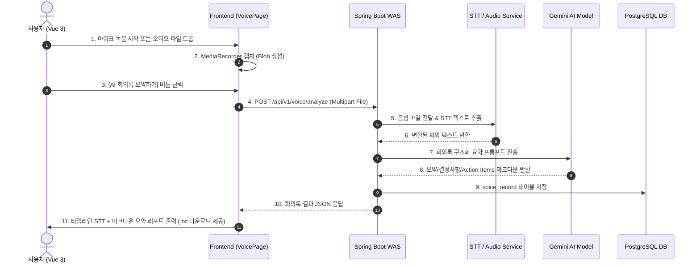

# [F8-1] 회의 녹음 & AI 회의록 자동 요약 기능 명세서 🎙️📋

> ## 0. 구현 확정 노트 (2026-07-30) ✅
>
> 아래 원안을 검토해 **1단계 MVP**를 확정·구현했다. 원안과 달라진 점:
>
> - **STT 방식**: 별도 STT 벤더(Clova/Google STT) 없이 **Gemini 멀티모달에 오디오를 직접 첨부**해 전사(`GeminiVoiceTranscriber`). 전사(`VoiceTranscriber` 인터페이스)와 요약을 분리해 **STT만 교체 가능**하게 설계.
> - **모델**: 전사·요약 모두 `gemini-2.5-flash`(무료 티어). 무료는 모델 품질이 아니라 요청 한도(RPM) 제약. 품질 병목 시 분석 호출만 Pro 로 올리거나 Clova 로 교체.
> - **스코프(1단계)**: **오디오 파일 업로드 → 전사 + 3단 요약 → 결과 2분할 표시 + TXT 다운로드**. (2단계: 실시간 녹음·웨이브폼 → 미구현 / 3단계: 이력 → 구현 완료(2026-07-30). 가이드/채팅 공유 → 폐기)
> - **프라이버시**: ~~오디오 원본은 저장하지 않고 전사문·요약만 DB에 남긴다.~~ → **2026-07-30 변경**: 이력에서 "올린 파일이 무엇이었는지" 확인·재생해야 한다는 요구에 따라 **오디오 원본을 보관**하도록 방침을 바꿨다. 저장 위치는 `app.upload.voice-dir`(기본 `uploads/voice`), DB(`voice_record`)에는 파일명·원본명·크기·MIME 타입만 남긴다. 이력에서 건별 삭제 시 파일도 함께 지운다. 자세한 내용은 [F8-1_VOICE_HISTORY_SPEC.md](F8-1_VOICE_HISTORY_SPEC.md) 참고.
> - **인증**: `/api/v1/voice/analyze` 는 `X-User-Seq` 헤더(WEB 인터셉터 주입) 사용.
> - **업로드 한도**: `max-file-size` 10MB→**25MB** 상향.

## 1. 개요 및 목적 (Overview)

- **기능 명**: 회의 녹음 & AI 회의록 자동 요약 (Voice Recording & AI Meeting Summarization)
- **목적**: Tiro, 다글로(Daglo), 클로바노트와 같은 전문 업무 생산성 도구처럼, 사내 회의 음성을 브라우저에서 직접 녹음하거나 오디오 파일을 업로드하여 **STT(텍스트 변환)** 및 **AI 기반 3단계 회의록 구조화 요약(요약/결정사항/Action Items)**을 10초 만에 자동으로 추출하고 TXT 저장 및 사내 지식 공유를 지원합니다.

---

## 2. 주요 세부 기능 (Feature Requirements)

| 기능 ID        | 기능 명                     | 상세 요구사항                                                                                                                                                                             |
| :------------- | :-------------------------- | :---------------------------------------------------------------------------------------------------------------------------------------------------------------------------------------- |
| **F8-1-1**     | **브라우저 실시간 녹음**    | HTML5 `MediaRecorder API`를 이용한 마이크 음성 녹음 (타이머, 웨이브폼, 녹음/정지/재개).                                                                                                   |
| **F8-1-2**     | **오디오 파일 업로드**      | 기존 회의 음성 파일(`.mp3`, `.wav`, `.m4a`, `.webm`) 드래그 앤 드롭 업로드 지원 (최대 25MB).                                                                                              |
| **F8-1-3**     | **STT 텍스트 변환**         | 음성 파일을 백엔드로 전송하여 타임스탬프가 포함된 텍스트(Speech-to-Text) 자동 추출.                                                                                                       |
| **F8-1-4**     | **AI 3단계 구조화 요약**    | Gemini AI 모델을 통한 구조화 리포트 생성:<br>① 📌 **회의 핵심 요약** (Summary)<br>② 💡 **주요 결정 사항** (Key Decisions)<br>③ 📝 **Action Items & 담당자/마감일**                        |
| **F8-1-5**     | **TXT 원클릭 다운로드**     | 변환된 회의록 원본 텍스트 및 AI 요약본을 `.txt` 파일로 클라이언트 원클릭 다운로드.                                                                                                        |
| ~~**F8-1-6**~~ | ~~**사내 지식/채팅 공유**~~ | **폐기(2026-07-30)** — 이 화면은 회의록을 AI로 정리·보관하는 도구로 목적을 축소했다. 가이드(RAG)·채팅 공유는 범위에서 제외. [F8-1_VOICE_HISTORY_SPEC.md](F8-1_VOICE_HISTORY_SPEC.md) 참고 |

---

## 3. 데이터 흐름도 및 아키텍처 (Architecture Flow)



---

## 4. 데이터베이스 스키마 설계안 (`voice_record`)

```sql
-- 회의 녹음 및 AI 요약 이력 관리 테이블
CREATE TABLE IF NOT EXISTS voice_record (
    record_seq      BIGSERIAL PRIMARY KEY,
    user_seq        BIGINT NOT NULL REFERENCES admin_user(user_seq),
    title           VARCHAR(200) NOT NULL,            -- 회의 제목
    audio_path      VARCHAR(500),                     -- 임시 저장된 오디오 파일 경로
    duration_seconds INT DEFAULT 0,                   -- 녹음 길이 (초)
    stt_text        TEXT NOT NULL,                    -- STT 원본 텍스트
    summary_md      TEXT NOT NULL,                    -- AI가 구조화한 마크다운 요약본
    created_at      TIMESTAMP WITH TIME ZONE DEFAULT CURRENT_TIMESTAMP
);

CREATE INDEX idx_voice_record_user ON voice_record(user_seq, created_at DESC);
```

---

## 5. REST API 명세서 (API Contracts)

### 5.1 회의 음성 분석 및 AI 요약 요청

- **HTTP Method**: `POST`
- **Endpoint**: `/api/v1/voice/analyze`
- **Content-Type**: `multipart/form-data`
- **Request Body**:
    - `file`: MultipartFile (오디오 파일)
    - `title`: String (회의 제목)
- **Response Body**:
    ```json
    {
        "recordSeq": 101,
        "title": "2026-07-30 Workmate v3 아키텍처 회의",
        "durationSeconds": 185,
        "sttText": "오늘 회의에서는 RAG VectorStore 쿼터 이슈를 논의했습니다...",
        "summaryMd": "### 📌 회의 핵심 요약\n- RAG 임베딩 쿼터 차단 방지를 위한...",
        "createdAt": "2026-07-30T14:35:00Z"
    }
    ```

### 5.2 회의록 이력 조회

- **HTTP Method**: `GET`
- **Endpoint**: `/api/v1/voice/history`
- **Response Body**: `List<VoiceRecordVo>`

---

## 6. UI/UX 와이어프레임 구성안 (`VoicePage.vue`)

1. **상단 컨트롤 섹션**:
    - 🔴 **녹음 시작** / ⏸️ **일시정지** / ⏹️ **중지** 대형 컨트롤러.
    - 실시간 타이머 (`02:35`) + 애니메이션 음성 파형(Waveform) 표시.
    - 드래그 앤 드롭 파일 업로드 구역 (`.webm`, `.mp3`, `.wav`).
2. **하단 2분할 메인 결과 화면**:
    - **좌측 파트 (Original STT Text)**: 타임라인별 원본 음성 변환 텍스트 + `[📥 TXT 다운로드]` 버튼.
    - **우측 파트 (AI Structural Report)**: Gemini AI가 탭별로 정리해 준 마크다운 회의록 (`핵심 요약` / `결정 사항` / `Action Items`) + `[📚 가이드로 등록]` / `[💬 채팅으로 공유]` 버튼.

---

## 7. 검토 및 승인 요청

본 명세서 및 설계안을 검토해 주시고, 승인해 주시면 **백엔드 DB 테이블/서비스 셋업 및 프론트엔드 UI 개발**을 순차적으로 신중하게 진행하겠습니다!
